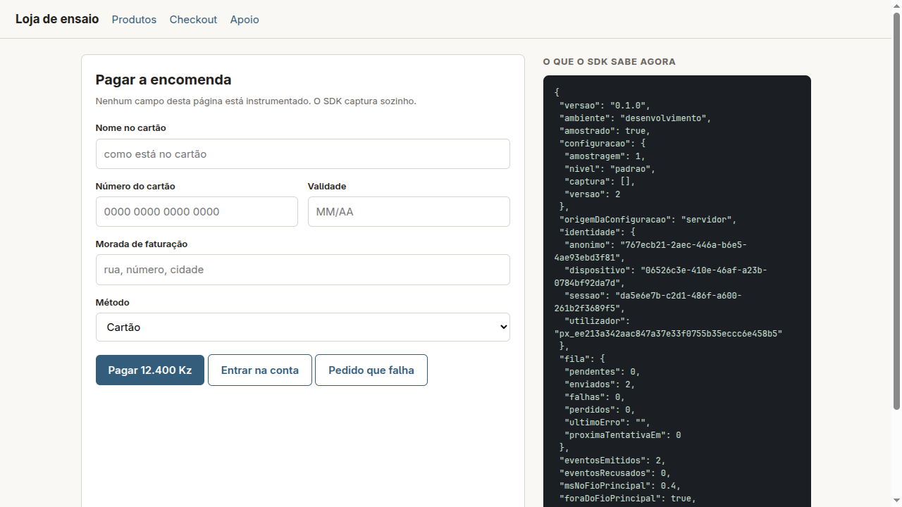

# sdk-js

> Peça do workspace **[ux-data-analysis](https://github.com/nerdy-nomads/ux-data-analysis)**, onde vive como
> submódulo em `sdk/sdk-js`. O plano, o quadro e o documento de arquitetura estão lá.

O SDK web. Cola-se uma linha no `head` e começa a medir, **sem nenhuma configuração
obrigatória além da chave**.

## A promessa que ele carrega

Do registo ao primeiro evento em **menos de dez minutos**. É o primeiro critério de
sucesso da Fase 1, e o que mais depressa mata a adoção quando falha.

Um SDK que exija declarar ecrãs, tarefas ou elementos antes de mostrar seja o que for
anula o princípio de **capturar primeiro e definir depois**, que é o produto.

## O que capta sozinho

Visualização de ecrã, toque ou clique, foco em campo, primeira tecla, desfoco,
submissão, erro de validação, navegação para trás, mudança para segundo plano e erro
de rede. Mais as mensagens que a aplicação mostra, e o preenchimento agregado por
campo.

**Nada disto é declarado pelo integrador.** A marcação manual existe para o que o
browser não deixa ver, e é a exceção: se se tornar a regra, o produto perdeu a
promessa, e vale a pena saber cedo.

## O que nunca faz

- **Não tem dependências.** Nenhuma, e não é preferência: o acréscimo ao tamanho da
  aplicação tem de ficar **abaixo de 300 KB** (`RNF-SDK-03`), e esse orçamento não
  sobrevive a uma árvore de dependências. Sem dependências, a auditoria também fica
  simples, e a auditoria é condição de adoção.
- **Não é React, e nada do React ou do Next.js lhe entra.** Corre dentro da aplicação
  de outra pessoa, que pode ter outra versão do React ou não ter React nenhum.
- **Não regista um único caractere escrito pelo utilizador.** Conta quantos foram
  escritos e quantos apagados, e isso não exige conhecer nenhum.
- **Não faz a aplicação anfitriã falhar.** Barreira de erro em todos os pontos de
  entrada, com injeção sistemática de falhas no CI.
- **Não trabalha no fio principal.**
- **Não emite um evento por tecla.** Um por campo, no desfoco.
- **Não envia nada sem mascarar** números, montantes, datas e identificadores dentro
  do texto capturado.

## Estado: existe, corre num browser a sério, e está medido

Os cartões `2.1` a `2.7` estão fechados. A integração é isto, e mais nada:

```html
<script src="https://cdn.uxda.io/uxda.js" data-chave="uxda_pro_..."></script>
```

| Caminho | O que é |
|---|---|
| `src/index.ts` | A API pública: arranque, `track`, `identificar`, `ecra`, `parar`, `diagnostico` |
| `src/captura/` | Os dez tipos do `RF-CAP-04`, mais o erro de rede da aplicação anfitriã |
| `src/fila/` | Fila persistente, lote, recuo exponencial e respeito por rede medida |
| `src/identidade/` | Identificadores do dispositivo, pseudonimização e a cadeia de sinais |
| `src/config/` | Configuração remota, com cache e valor por omissão que mede tudo |
| `src/core/trabalhador.ts` | O envio fora do fio principal, e o recuo para quando não dá |
| `src/identity/` | Os cinco sinais de identidade de elementos, do cartão `0.2` |
| `src/safe.ts` | A barreira de erro. Nenhum erro interno chega à aplicação anfitriã, e **cada um conta-se** por sítio e tipo, e segue no lote seguinte em `erros_sdk`, sem a mensagem (ADR 0045) |
| `exemplo/` | Uma loja de ensaio **sem uma linha de instrumentação**, para ver a correr |
| `tools/orcamento.ts` | Os dois orçamentos, que falham a compilação no CI |

```bash
npm run check      # tipos, 233 ensaios, empacotamento e os dois orçamentos
npm run build      # dist/uxda.js (CDN, arranca sozinho) e dist/uxda.mjs (npm)
./exemplo/servir.sh <chave> 8091     # a loja de ensaio, num browser a sério
```

### Os números, medidos e não estimados

| O quê | Medido | Limite |
|---|---|---|
| Tamanho do pacote | **76,3 KB** (27,6 KB comprimido), com o componente de avaliação da fase 14 | 300 KB (`RNF-SDK-02`) |
| Fio principal, por evento capturado | **0,038 ms** no computador (fase 14); **0,236 ms** num telemóvel de um núcleo, medido na fase 2 | 1 ms |
| Tráfego | **524 bytes** por evento entregue | - |
| Ensaios | 233, incluindo fuga de conteúdo e injeção de falhas | - |

O ensaio no telemóvel é um emulador Android com **um núcleo** e 1 GB de memória.
A bateria não se mede lá (o medidor do emulador é sintético, e responde
`Computed drain: 0`), por isso o custo aparece como tempo de CPU, que é o que a
gasta: sobre 2000 eventos, a diferença de CPU do processo do browser com e sem o
SDK ficou **dentro do ruído da medição**, cerca de 2 centésimos de segundo.



### Quatro coisas que só apareceram por correr isto num browser a sério

**Os ouvintes estavam fora da barreira de erro.** A barreira protegia o que se
emitia, e não o ouvinte que chamava o emissor: um elemento que lançasse ao ser
interrogado mandava a exceção para o despacho de eventos da aplicação anfitriã, e
ela passava a ter avarias nossas com a cara dela. Foi a bateria de injeção de
falhas do `2.7` a apanhar.

**Guardar a fila custava o quadrado do tamanho dela.** Cada evento serializava a
fila inteira para saber se ainda cabia. Com a contagem à medida e a escrita
adiada para o fim do lote, o custo no fio principal caiu de 0,78 ms para 0,031 ms
por evento: **vinte e cinco vezes**.

**As rotas em `#` não mudavam o ecrã.** Metade das aplicações de página única
navega assim, e todas elas apareciam como um ecrã só durante a sessão inteira.

**A reescrita retroativa da identidade tinha uma corrida.** Os eventos que iam a
caminho no momento em que a pessoa se autentica chegavam depois da reescrita e
ficavam sem pseudónimo para sempre. Fechou-se na ingestão, que preenche o dono
quando já o conhece.

## A API pública

Dez funções, e nenhuma é obrigatória para o SDK medir. Todas passam pela
barreira do `RNF-SDK-01`: um erro interno devolve um valor seguro e nunca chega à
aplicação anfitriã.

| Chamada | Para quê |
|---|---|
| `uxda.track(nome, extras?)` | Marcação manual, para o que o browser não deixa ver (`RF-CAP-08`). É a **exceção**: se se tornar a regra, o produto perdeu a promessa |
| `uxda.identificar(id)` | Liga o anónimo ao pseudónimo depois da autenticação. **O que parecer um identificador direto é resumido aqui**, e o original não sai do dispositivo |
| `uxda.esquecer()` | Termina a ligação: os eventos seguintes voltam a ser anónimos |
| `uxda.ecra(nome)` | Declara um ecrã, para aplicações que mudam de vista sem mudar o URL |
| `uxda.passo(nome)` | Declara uma transição de passo dentro da tarefa (`RF-GRA-20`), para fluxos que acontecem no mesmo ecrã |
| `uxda.terminal(estado)` | Fecha a tentativa sem ambiguidade: `sucesso`, `erro`, `abandonado` ou `expirado` |
| `uxda.mensagem(chave, tipo, extras?)` | Declara uma mensagem apresentada ao utilizador. Para o que o SDK não vê sozinho: um `canvas`, uma notificação do sistema, ou uma aplicação que prefere declarar a chave |
| `uxda.erroTecnico(chave, props?)` | Declara um erro que **ninguém viu no ecrã** (`RF-MSG-06`): uma promessa rejeitada, uma resposta ilegível, um passo que falhou em silêncio |
| `uxda.inquerito(chave)` | Pede um inquérito pelo código da instituição (`RF-PER-04`). **Salta o sorteio e não salta mais nada**: a fadiga, a pergunta ao servidor e o limite de um por sessão valem na mesma. Devolve `true` quando o componente apareceu |
| `uxda.descarregar()` | Força o envio do que está na fila |
| `uxda.parar()` | Desliga tudo, sem deixar ouvintes atrás |
| `uxda.consentimento(dado)` | O sinal de consentimento da pessoa (`RNF-PRI-12`, ADR 0047). Com `data-consentimento="exigido"` no `script`, nada corre até `consentimento(true)`; `consentimento(false)` para já, apaga a fila e os identificadores do dispositivo e guarda só a recusa |
| `uxda.diagnostico()` | O que o SDK sabe: identidade, fila, configuração, custo no fio principal e erros internos |

```html
<!-- O que é obrigatório: a chave. -->
<script src="https://cdn.uxda.io/uxda.js" data-chave="uxda_pro_..."></script>

<!-- O que é opcional, e para que serve. -->
<script src="https://cdn.uxda.io/uxda.js"
        data-chave="uxda_pro_..."
        data-servidor="https://ingest.uxda.io"
        data-versao="4.2.0"
        data-automatico="false"></script>
```

Por npm, para quem quer decidir o momento do arranque:

```js
import { iniciar } from "@uxda/sdk-js";
const uxda = iniciar({ chave: "uxda_pro_...", versao: "4.2.0" });
```

## Só fala cifrado

O SDK envia por HTTPS, e **recusa um endereço em `http://`** que não seja a própria máquina
(`localhost`, `127.0.0.1`, `::1`, e `10.0.2.2`, que é a máquina vista do emulador Android):
não arranca, não escreve nada no dispositivo, e `diagnostico().transporte` diz `"recusado"`. Um endereço mal
escrito na configuração não pode pôr o comportamento de ninguém a circular em claro
(cartão 18.6, ADR 0050).

## O que capta, campo a campo

[`CAMPOS.md`](CAMPOS.md) lista cada campo e cada propriedade que este SDK envia, com a
finalidade e a ligação à linha do código que o produz, neste repositório e no do outro SDK.
É gerada a partir do esquema (`python3 scripts/campos-capturados.py`, na raiz do projeto) e
**um ensaio falha se o SDK enviar um campo que ela não lista**, ou se uma ligação deixar de
apontar para uma linha que produz o campo (cartão 18.5).

## A bateria de fuga cobre toda a captura

`src/fuga-total.test.ts` (cartão 18.2) corre o SDK inteiro sobre uma página com segredos
em todo o lado: no endereço, nas ligações, nos rótulos, nos atributos de teste, nos pedidos
de rede da aplicação e nos nomes que a API recebe, nos três níveis e com o rastreio
individual ligado. Falha se um segredo sair em qualquer forma (escrito, codificado, em
minúsculas, só os algarismos), e **falha se algum tipo de evento do esquema não tiver sido
percorrido**: um caminho de captura novo sem ensaio aqui faz o CI cair no dia em que entra.
Em volume, mil pessoas com dados gerados: 4 000 valores pessoais, 2 793 eventos, 0 fugas.
Corre em `npm run fuga`, que é um passo próprio do CI.

## O que a aplicação lhe passa sai mascarado

As propriedades do `track()` e a operação do `mensagem()` e do `erroTecnico()` passam por
um ponto só (`src/privacidade.ts`): uma chave que o esquema não conhece não sai (e conta-se
em `diagnostico().propriedadesDescartadas`), e um valor de texto sai com as regras de uma
mensagem sem chave. Só a lista de permissões da instituição levanta a máscara, e nunca o
chão: correio, números longos e referências saem sempre mascarados, também nos nomes de
ecrã, passo, evento e mensagem. Os ensaios estão em `src/privacidade.test.ts`. ADR 0047.

## Mensagens: dê-nos a chave, e o texto não sai do dispositivo

O SDK apanha sozinho o que a aplicação mostra: `role="alert"`, `role="status"`,
`aria-live`, `<output>`, e as classes do costume (`toast`, `snackbar`, `alert`,
`invalid-feedback`, `notification`). Classifica em **erro, aviso, sucesso e
informação**, e separa os erros em **validação num campo, operação e sistema**,
que é a diferença entre três equipas que fazem trabalho diferente.

Quando a aplicação diz qual é a mensagem, o resultado é melhor em três frentes ao
mesmo tempo, e é por isso que vale a pena:

```html
<!-- Uma linha, e não muda nada no que a pessoa vê. -->
<div role="alert" data-uxda-mensagem="saldo_insuficiente">Saldo insuficiente</div>
```

| Sem chave, só com texto | Com chave |
|---|---|
| O texto sai, **mascarado** | **O texto não sai de todo.** Não há nada para mascarar nem para arriscar |
| A mesma mensagem em português e em inglês dá **duas entradas** no catálogo | Dá **uma**, e a contagem é a verdadeira |
| Mudar a redação parte a série histórica | A série sobrevive a qualquer reescrita |
| A mascaragem é uma heurística, e mascara a mais | Não há heurística nenhuma pelo meio |

O atributo pode ser `data-uxda-mensagem`, `data-mensagem`, `data-message-key`,
`data-i18n` ou `data-l10n-id`: se já usa uma biblioteca de tradução, **já tem a
chave** e não precisa de escrever nada.

E quando não há chave, o texto sai assim:

```
O saldo de 12.400,50 Kz do documento 005123456LA041 nao chega para Ana Maria da Silva em 2027-03-14
→ O saldo de {numero} Kz do documento {id} nao chega para {nome} em {data}
```

Números, montantes, datas, horas, correio electrónico e identificadores, que é o
que o `RF-MSG-04` enumera; e ainda **nomes de duas ou mais palavras e o que estiver
entre aspas**, que o requisito não enumera e existe na mesma. Tudo isto acontece
**no dispositivo, antes de qualquer envio**, e a ingestão volta a verificar: um
texto que chegue com um arroba ou com cinco algarismos seguidos é recusado, e não
mascarado do outro lado.

A instituição pode autorizar chaves cuja mensagem sai por inteiro
(`mensagens_expostas`, na configuração remota). **Há um chão que essa lista não
levanta:** números, identificadores e correio electrónico saem sempre mascarados.
O desenho inteiro está no
[ADR 0020](../../docs/adr/0020-mensagens-a-chave-o-texto-e-o-chao-da-mascaragem.md).

## Como identifica um elemento

Cadeia de **cinco** sinais com reserva, calculada no dispositivo: atributo explícito
de teste, caminho estrutural estável, rótulo normalizado em resumo, **destino da
ligação normalizado**, e papel mais posição no contentor.

O quinto entrou depois da medição do `0.2`, e não estava no desenho: sem ele, uma
barra de navegação dava 40,9% de elementos ambíguos. Com ele, 2,2%.

**A identidade é o tuplo dos cinco sinais, e não o principal sozinho**, que colide em
41% dos elementos de uma página real. O servidor reconcilia por maioria quando o principal muda entre
versões.

**Quando não reconcilia, o elemento aparece como novo, nunca como outro.** Um
histórico partido é mau; um histórico silenciosamente errado é pior, porque quem o lê
acredita nele.

## Stack

**TypeScript**, sem dependências de execução. Empacotado com `esbuild` e
distribuído por CDN e por npm. A auditoria está em [`AUDITORIA.md`](AUDITORIA.md).

## O componente de avaliação: aparece sozinho, e nunca pergunta de mais

Fase 14, cartões `14.1` e `14.2`. O contrato inteiro está em
[`docs/contrato-das-respostas.md`](../../docs/contrato-das-respostas.md), e o desenho
no [ADR 0034](../../docs/adr/0034-uma-resposta-e-anonima-ate-alguem-decidir.md).

**Não é preciso escrever uma linha.** As regras chegam na configuração remota
(`inqueritos` do `GET /v1/config`), e o SDK avalia os gatilhos sobre os eventos que
ele próprio emite: depois de concluir uma tarefa, depois de a abandonar (no arranque da
sessão seguinte), depois de um erro, na primeira utilização de uma funcionalidade, ou
por amostragem. Mudar uma regra na consola muda o que a sessão seguinte pergunta, sem
publicar a aplicação.

| Peça | O que faz |
|---|---|
| `src/inquerito/regras.ts` | Os critérios das definições de tarefa, avaliados sobre um evento: os mesmos campos e os mesmos oito operadores do `core/definition` |
| `src/inquerito/gatilhos.ts`, `estado.ts` | Os cinco gatilhos, e o que sobrevive entre sessões (a tentativa começada e não acabada, a primeira utilização já vista) |
| `src/inquerito/fadiga.ts` | A primeira linha da fadiga, no dispositivo. **Quem decide é o servidor** |
| `src/inquerito/envio.ts` | A elegibilidade antes de mostrar, e a resposta com uma repetição e o mesmo `resposta_id` |
| `src/inquerito/componente.ts` | O cartão, num `Shadow DOM`, com o tema da instituição |
| `src/captura/fora.ts` | O que a captura nunca vê: o próprio componente |

**As regras que não se dobram:**

- **Uma em dez por omissão.** Depois do gatilho há um sorteio com a amostragem da regra,
  depois a fadiga do dispositivo, depois a pergunta ao servidor. **Sem resposta do
  servidor, não se mostra.** E nunca mais de um inquérito por sessão.
- **Não bloqueia a página.** É um cartão fixo num canto, sem película por cima, sem
  prender o foco (`role="dialog"`, `aria-modal="false"`); fecha-se com `Esc` ou com o
  botão. Visto num browser a sério: com o cartão aberto, os botões da loja continuaram a
  responder.
- **O comentário sai mascarado.** Pela mesma função das mensagens, com um chão por cima
  que tira todos os algarismos e arrobas: o servidor recusa um comentário com conteúdo, e
  uma resposta inteira perdida por um "passo 3" era um mau negócio. A bateria de fuga
  enche a página de segredos, responde com um cartão e um correio no comentário, e lê o
  tráfego todo.
- **O componente não se captura a si próprio.** O anfitrião do `Shadow DOM` está fora da
  captura, e há um ensaio que o prova: nenhum `campo`, `tecla` ou `toque` sai de lá.
- **Um erro interno não chega à loja.** Tudo passa pela barreira do `RNF-SDK-01`, e um
  ensaio força um erro no desenho do cartão.

Os cinco formatos: esforço (1 a 7), satisfação (1 a 5), recomendação (0 a 10), escolha
múltipla e campo livre, com o comentário opcional nos quatro primeiros. O tema (cores,
tipografia, cantos e idioma) vem da consola.

**Visto a correr contra a ingestão verdadeira** (loja de ensaio, 2026-09-14): o cartão
apareceu com o tema da consola (verde institucional, Georgia, cantos de 20 px), a
resposta de esforço chegou à tabela com o comentário `o cartão {id} foi recusado,
escrevam para {email}`, e a de escolha múltipla com as duas opções escolhidas.

## Os cartões que o constroem

| Cartão | O que acrescenta |
|---|---|
| `2.1` | Fundação numa linha, sem configuração |
| `2.2` | Captura automática dos eventos base e marcação manual |
| `2.3` | Identificação estável de elementos |
| `2.4` | Fila local, envio em lote, funcionamento sem ligação |
| `2.5` | Identidade pseudonimizada e continuidade entre dispositivos |
| `2.6` | Configuração remota e amostragem sem nova publicação |
| `2.7` | As garantias: nunca falhar a anfitriã, 300 KB, fora do fio principal |
| `4.1` a `4.5` | Captura granular e agregação no dispositivo |
| `5.1` a `5.4` | Mensagens de sistema, mascaramento, testes de fuga |
| `9.1` | Coordenadas do toque, caixa do elemento, ordem da interação e profundidade de deslocamento |
| `14.1`, `14.2` | Componente de avaliação embutido, gatilhos remotos e controlo de fadiga |
| `18.1`, `18.2` | Mascaramento por omissão e testes de fuga alargados |

## O rastreio individual: duas condições, e nunca uma fotografia

As coordenadas de um toque, a caixa do elemento em que ele caiu, a ordem da interação
dentro do ecrã e a profundidade de deslocamento **só saem com duas coisas ligadas**:

- o nível **detalhado**, que diz quanta granularidade se capta;
- o **rastreio individual** do projeto, que diz se é legítimo seguir uma pessoa.

São decisões diferentes de quem opera (`RF-IND-09`), e com uma condição só, desligar o
rastreio deixava de mostrar e continuava a recolher. **A zona continua a sair sempre**:
ela é uma grelha de seis por dez e agrupa sem localizar ninguém.

O que sai é em **percentagem do visor**, e não em pixéis: a pergunta é *onde é que as
pessoas tocam neste ecrã*, e um mapa em pixéis é um mapa por modelo de telemóvel.

**E este SDK não sabe fotografar um ecrã.** Não é uma promessa: é o
`src/sem-ecra.test.ts`, que percorre o código publicado e falha se encontrar
`toDataURL`, `getDisplayMedia`, `captureStream`, `innerHTML` ou mais oito. É a irmã da
bateria de fuga: aquela olha para o tráfego, esta olha para o que o código sabe fazer.

## Ler antes de mexer

A secção 5.1 do documento de requisitos, e as decisões **D-03** e **D-10** em
[`docs/arquitetura.html`](https://github.com/nerdy-nomads/ux-data-analysis/blob/master/docs/arquitetura.html).
